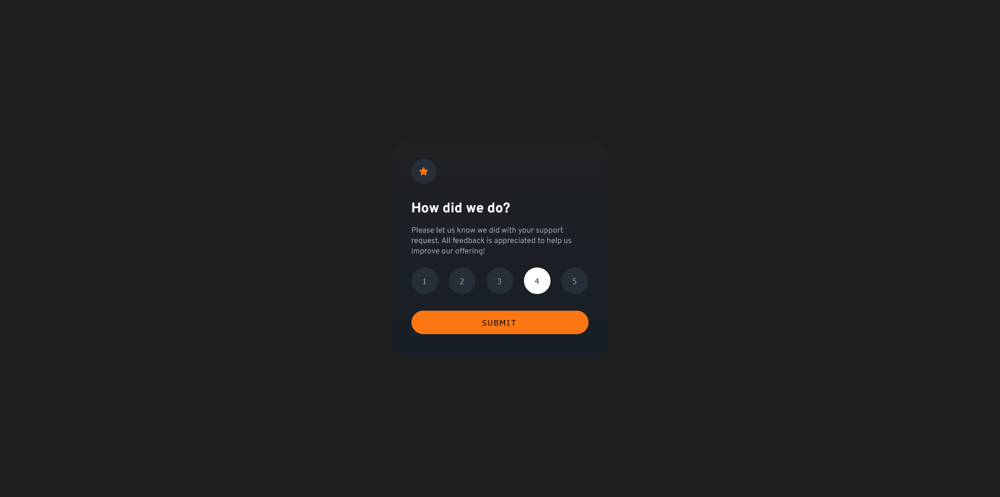
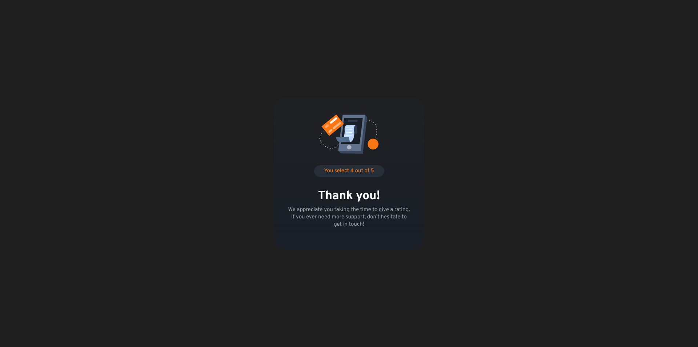

# Frontend Mentor - Interactive Rating Component Solution

This is a solution to the [Interactive rating component challenge on Frontend Mentor](https://www.frontendmentor.io/challenges/interactive-rating-component-koxpeBUmI). Frontend Mentor challenges help you improve your coding skills by building realistic projects.

## Table of contents

-   [Overview](#overview)
    -   [The challenge](#the-challenge)
    -   [Screenshot](#screenshot)
-   [My process](#my-process)
    -   [Built with](#built-with)
    -   [What I learned](#what-i-learned)
    -   [Continued development](#continued-development)
-   [Author](#author)

**Note: Delete this note and update the table of contents based on what sections you keep.**

## Overview

A simple and basic project about a box with selectable options ranging from 1 to 5. After selecting an option, the choice buttons disappear, and a "Thank you" message with the selected option is displayed.

### The challenge

Users should be able to:

-   View the optimal layout for the app depending on their device's screen size
-   See hover states for all interactive elements on the page
-   Select and submit a number rating
-   See the "Thank you" card state after submitting a rating

### Screenshot




## My process

I started with the HTML. For this project, I used Figma. I structured the HTML from macro to micro, trying to identify semantic tags that could be used. I didn’t focus much on naming classes and IDs.  
For the CSS, I styled everything according to the Figma design, using classes and IDs as specifically as possible, starting with the higher-level tags in the hierarchy.  
Finally, in JavaScript, I selected most elements by ID, except for the input choices, which I selected by class. I implemented the logic to highlight the selected option on click and remove the highlight from any previously selected options using `forEach`. Although I haven’t fully studied this method yet, I understand its functionality, though I haven’t written its syntax entirely by myself yet.  
For the rest of the project, I used simple techniques like toggling between `display: none;` and `display: block;`. A trick in this code was placing the div with `display: none;` and `display: block;` as the parent of the Flexbox-styled div. This ensured no interference with the display properties when toggling visibility on click.  
Toward the middle and end of the project, I had to adjust two HTML tags and add a `:hover` effect in the CSS.

### Built with

-   Semantic HTML5 markup
-   CSS custom properties
-   Flexbox
-   JavaScript

### What I learned

It was my first time using `forEach`. It loops through all the inputs, adds an `addEventListener` for click events using `forEach`, and uses `forEach` again to remove all selected states. After removing the selected state from all, it applies the selected state to the clicked button. Finally, the function updates the text in the paragraph.  
I used ChatGPT 4.0 to help me with this function and ended up learning about `forEach`, but I haven’t written one entirely on my own yet.

```javascript
function selectChoice() {
    const inputs = document.querySelectorAll(".inputs");
    const selectChoice = document.getElementById("select-choice");
    inputs.forEach((button) => {
        button.addEventListener("click", () => {
            // Remove the 'selected' class from all buttons
            inputs.forEach((btn) => {
                btn.classList.remove("select");
                console.log("Removing the 'select' class from", btn.value);
            });

            // Add the 'selected' class only to the clicked button
            button.classList.add("select");
            selectChoice.innerText = `You selected ${button.value} out of 5`;
        });
    });
}
```

### Continued development

    My future plans are to finish the JavaScript course, learn React, and on the server-side, explore Node.js.

## Author

-   instagram - [@fred_alves23](https://www.instagram.com/fred_alves23)
-   Frontend Mentor - [@barislideri](https://www.frontendmentor.io/profile/barislideri)
-   Twitter - [@FredericoGA70](https://x.com/FredericoGA70)
